# **Status Report**
### Jin Choi
#### 2023.03.21
#### SNU Internal Meeting
---
### **Contents**
- Introduction
- Plots - Signal Regions
- Method
- Templates
- Systematics
- Results
- Conclusion
---
### **Introduction**
#### About status
- Training ML discriminators done in early Feb.
- Currently moved on limit extraction in $3\mu$ channel
#### Using 3 discriminant observables:

1. $M(\mu^+\mu^-)$ 
2. signal vs. tt+Fake score 
3. signal vs. tt+X(W, Z, H) score

---
### **Plots** - Signal Regions (MHc-100 / MA-60)


 

---
### **Plots** - Signal Regions (MHc-130 / MA-90)

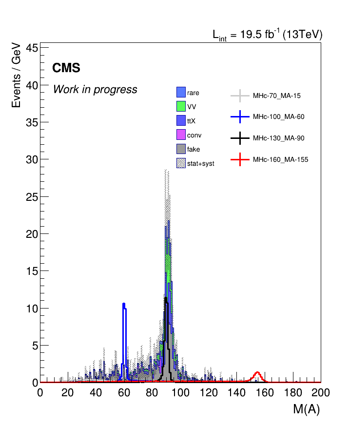
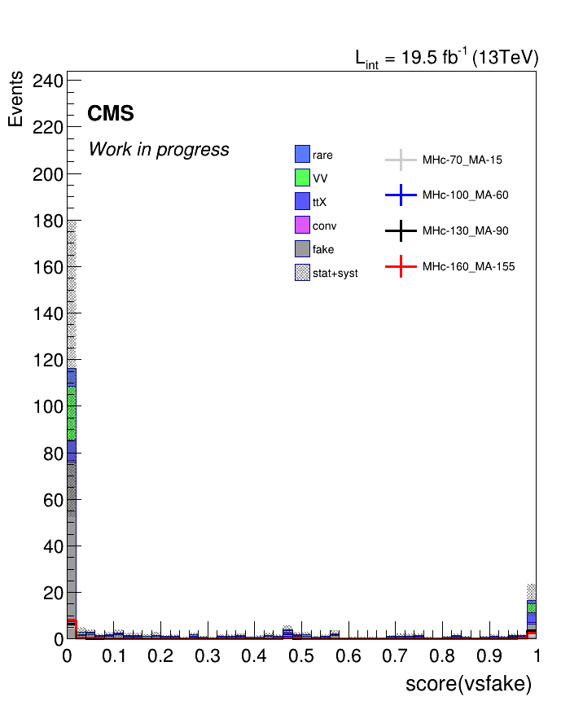
 

---
### **Method**
### Baseline Limit Extraction
- Using only $M(\mu^+\mu^-)$ distribution
- shape analysis (intrinsic width of Z and A is different)

### Limit Extraction with ML scores
- Optimize the event selection with scores within $M_A$ resolution
- regenerate $M_A$ templates
- not presented today

---
### **Method**
### Making template
- Events Selection: Baseline Selection + $M_A \pm5$ GeV with $0.1$ GeV binning ($3$ GeV for $M_A = 15$ GeV)
- For weight variations: vary weights only after the final selection
- For scale variations: redefine the object and re-select the events
- Final limit extraction done with Asysmptotic manner:
  ```sh
  combine -M AsymptoticLimits workspace_nocut.root -m 125 --run blind
  ```

---
### **Templates**
##### No ML cuts

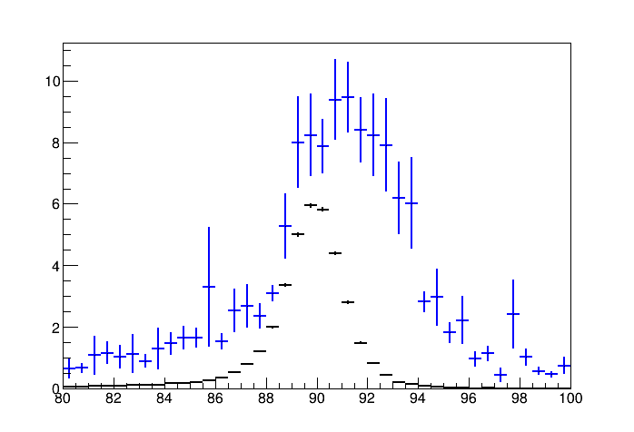


---
### **Templates**
##### With DNN cuts
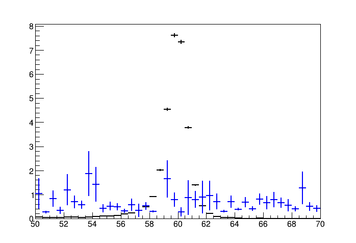
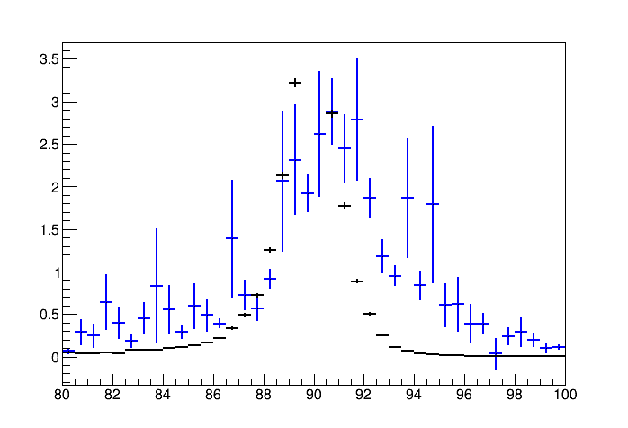
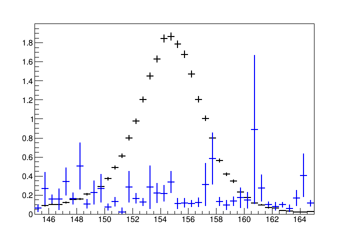

---
### **Systematics**
- Partial systematic tables
- For fake bkgs, $~\pm30\%$ variations in fake rates
- For conversion bkg, $~\pm80\%$ variations (dominant from stat & fake contribution)
- For other MC samples,
1. Scale Variations: Jet Energy, Jet Resolution
2. Weight Variations: Muon ID eff, DblMuTrig eff.

---
### **Notes**
- $\sigma_{sig}$ = $\sigma (pp \rightarrow t\bar{t})$$Br(t \rightarrow H^+b)$$Br(H^+ \rightarrow W^+A)$$Br(A \rightarrow \mu\mu)$ assumed to be $15$ fb (POI = 1)
- Experimental sensitivity is almost indep. of $M_{H^+}$, so the limit will be presented in ascending order of $M_A$
- For $M_A$ ~ $60$ GeV, tt+Fake is the most dominant bkg
- For $M_A$ ~ $90$ GeV, tt+Z is the most dominant bkg
- For $M_A$ > $120$ GeV, almost no bkg. exists

---
### **Results** - Limit plots / 2016, $3\mu$ channel only
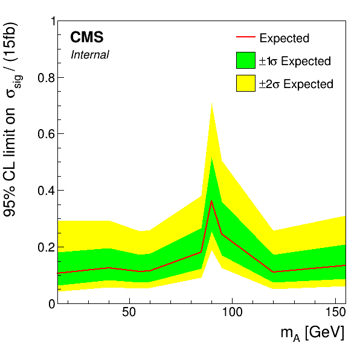
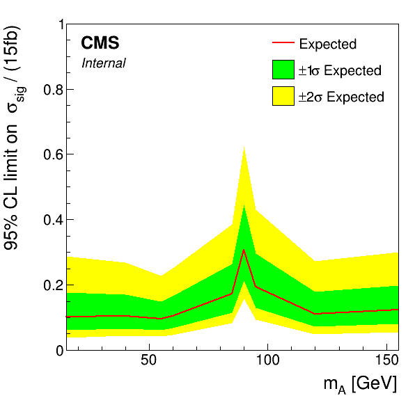

---
### **Conclusion**
- Expected limits using 2016 data only / $3\mu$ channel results have been shown
- How to use the ML discriminants?

### **To do**
- Limit plots / tables will be updated sequentially right after the data processing finished (~Next Week?)
- Comparison of Traditional / DNN / GNN method will be presented (~2 weeks?)
- Adding $1e2\mu$ channel (~after KPS?)

---
### **Back Ups**
##### Using 35.9 \fb (2016) only
|$M_{H^+}$ $M_A$ [GeV]| 70 15 | 70 40 | 130 55 | 100 60 | 160 85 | 130 90 | 100 95 | 160 120 | 160 155 |
|:-------:|:--:|:--:|:---:|:---:|:---:|:---:|:---:|:---:|:---:|
|exp-2 [fb] |0.63|0.86|0.78|0.81|**1.35**|**2.83**|**1.86**|0.77|0.92|
|exp-1 [fb] |0.96|1.22|1.10|1.14|**1.86**|**3.82**|**2.56**|1.10|1.31|
|exp 0 [fb] |1.60|1.88|1.67|1.71|**2.71**|**5.42**|**3.67**|1.67|1.99|
|exp+1 [fb] |2.72|2.94|2.59|2.63|**4.00**|**7.73**|**5.39**|2.58|3.11|
|exp+2 [fb] |4.39|4.41|3.83|3.88|**5.70**|**10.6**|**7.58**|3.86|4.66|

---
### **Back Ups**
##### Control Region - Z+Fake
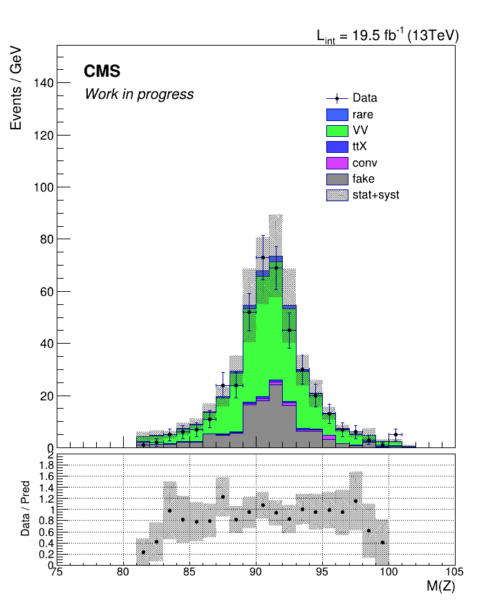
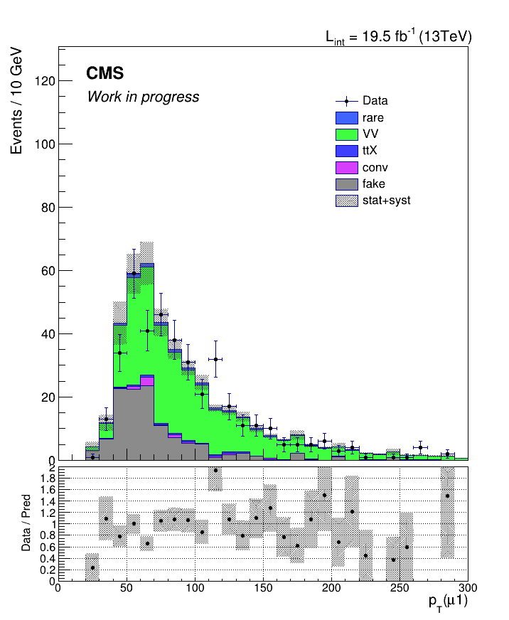
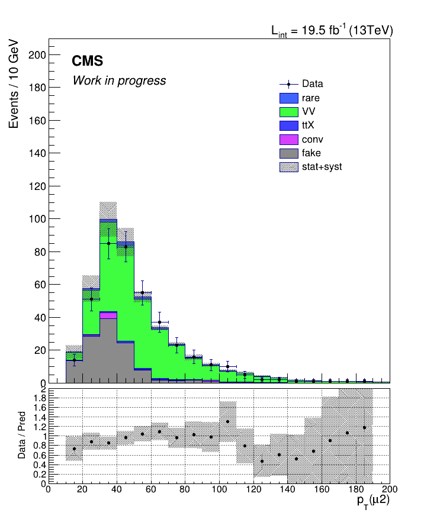

---
### **Back Ups**
##### Control Region - Z+$\gamma$

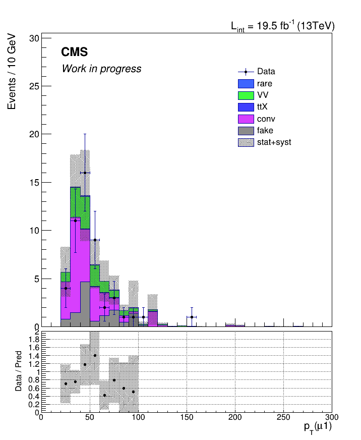
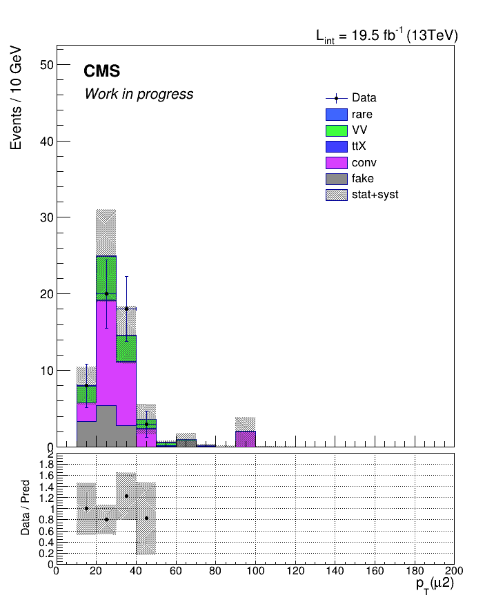
